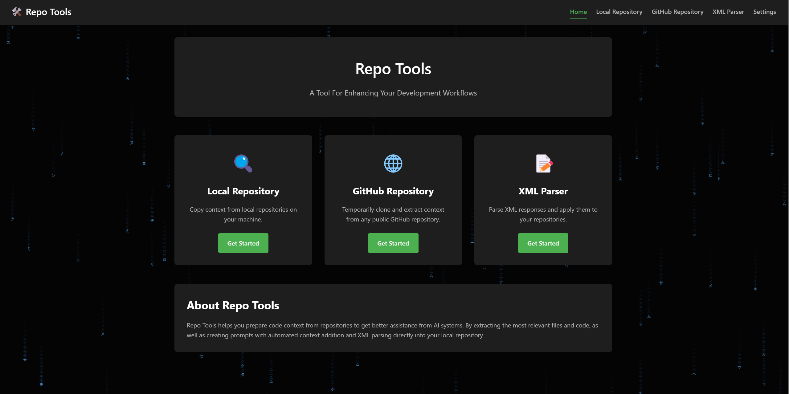
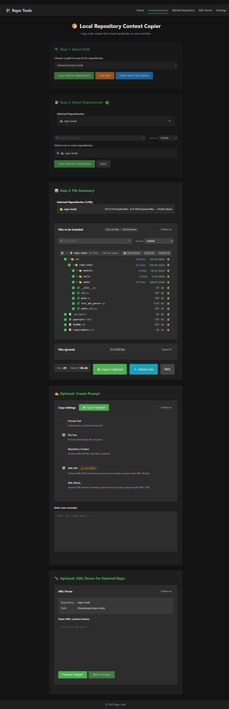

# Repo Tools


---


## Install

```bash
python -m venv venv
source venv/bin/activate

pip install -r requirements.txt

pip install -e .
```

## How To Use

```bash
# Use CLI Menu
repo-tools

# Use WebUI
repo-web
```

## Features
- **Copy local or remote repositories file context easily**
- **Parse XML straight into your local repository**
- **Craft prompts with automated context addition**

## More CLI Options

```bash
# Run in debug mode
repo-web --debug

# Don't auto-open the browser
repo-web --no-browser

# Run in the background
repo-web --background
```
